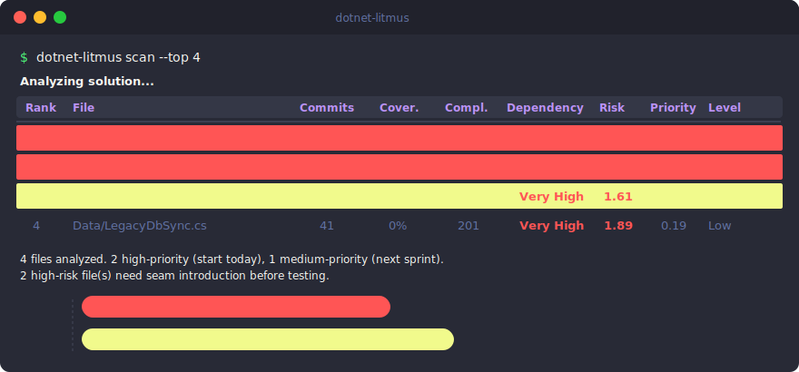

# Litmus

[](https://www.nuget.org/packages/dotnet-litmus)
[](https://www.nuget.org/packages/dotnet-litmus)
[](https://github.com/ebrahim-s-ebrahim/litmus/blob/main/LICENSE)

*Find where to start testing in a legacy codebase.*

<p align="center">
  
</p>

Litmus is a .NET global CLI tool that answers two questions:

1. **Where is it dangerous to leave code untested?** — ranked by *Risk Score*
2. **Where can you actually start testing today?** — ranked by *Starting Priority*

The result is a ranked table. Files that are dangerous **and** practically testable appear at the top. Files that are dangerous but heavily entangled appear lower, with a clear signal to introduce [seams](https://www.oreilly.com/library/view/working-effectively-with/0131177052/) first.

## Quick Start

```bash
# Install
dotnet tool install --global dotnet-litmus

# Run from the directory containing your .sln file
dotnet-litmus scan
```

That's it. The tool auto-detects the solution file, runs tests, collects coverage, and produces a prioritized report.

### No tests yet?

```bash
# Analyze without running tests — ranks by churn, complexity, and testability
dotnet-litmus scan --no-coverage
```

## Understanding the Output

```
Rank  File                           Commits  Coverage  Complexity  Dependency  Risk  Priority  Level
1     Services/OrderService.cs       47       12%       94          Low         1.42  1.42      High
2     Services/ReportFormatter.cs    22       31%       67          Low         0.71  0.71      High
3     Controllers/PaymentGateway.cs  31       8%        118         Very High   1.61  0.32      Medium
4     Data/LegacyDbSync.cs           41       0%        201         Very High   1.89  0.19      Low

4 files analyzed. 2 high-priority (start today), 1 medium-priority (next sprint). 2 high-risk file(s) need seam introduction before testing.
```

### Reading the table

| Column | Meaning |
|---|---|
| **Commits** | Number of git commits touching this file in the analysis window |
| **Coverage** | Line coverage from the Cobertura report |
| **Complexity** | Cyclomatic complexity (sum across all methods) |
| **Dependency** | Cost of adding test seams: `Low`, `Medium`, `High`, `Very High` |
| **Risk** | How dangerous it is to leave untested (0-2.0) |
| **Priority** | Where to start testing today (0-2.0) |
| **Level** | Actionable tier based on Starting Priority |

`PaymentGateway.cs` has a *higher* Risk (1.61) than `OrderService.cs` (1.42), but its `Very High` dependency level pushes its Starting Priority down to 0.32 (Medium). The tool is telling you: *"This file is dangerous, but introduce seams before attempting to test it."*

### Row colors

| Color | Meaning |
|---|---|
| Red | High priority — risky and testable now |
| Yellow | Medium priority — plan for next sprint |
| Default | Low priority — backlog or too entangled |

The **Risk** column is independently colored to highlight dangerous-but-entangled files.

### Priority and risk levels

| Level | Score Range | Priority meaning | Risk meaning |
|---|---|---|---|
| **High** | >= 0.6 | Start here — testable now | Changes often, poorly tested, complex |
| **Medium** | >= 0.2 | Plan for next sprint | Moderate risk |
| **Low** | < 0.2 | Backlog or too entangled | Low churn, well-tested, or simple |

## Commands

Litmus has two commands: `scan` runs tests and analyzes in one step; `analyze` skips testing and uses an existing coverage file.

### `scan` — run tests and analyze in one step

```bash
# Auto-detect solution file from current directory
dotnet-litmus scan

# Specify solution explicitly
dotnet-litmus scan --solution MyApp.sln

# Target a specific test directory
dotnet-litmus scan --solution MyApp.sln --tests-dir tests/MyApp.Tests

# Export results
dotnet-litmus scan --output report.json
```

`scan` auto-detects the solution file when a single `.sln` or `.slnx` exists in the current directory. It then:

1. Runs `dotnet test` with the XPlat Code Coverage collector
2. Streams live output so you see build progress and test results in real time
3. Discovers and merges all `coverage.cobertura.xml` files (one per test project)
4. Runs the full analysis pipeline (git churn, complexity, seam detection, scoring)
5. Cleans up temporary test results

### `analyze` — use an existing coverage file

```bash
# Auto-detect solution, provide coverage file
dotnet-litmus analyze --coverage TestResults/.../coverage.cobertura.xml

# Specify solution explicitly
dotnet-litmus analyze --solution MyApp.sln --coverage coverage.xml
```

Use `analyze` when you already have a Cobertura XML coverage report (e.g., from CI).

## CLI Reference

### Shared options

| Option | Default | Description |
|---|---|---|
| `--solution` | auto-detect | Path to `.sln` or `.slnx`. Auto-detected when one exists in cwd. |
| `--since` | 1 year ago | Git history cutoff (ISO date format, e.g. `2025-01-01`) |
| `--top` | 20 | Number of files to display |
| `--exclude` | -- | Glob pattern(s) to exclude (repeatable) |
| `--output` | -- | Export to `.json` or `.csv` file |
| `--baseline` | -- | Previous JSON export for delta comparison |
| `--format` | table | Stdout format: `table`, `json`, or `csv` |
| `--verbose` | false | Show detailed intermediate scores |
| `--quiet` | false | Suppress all output except errors |
| `--no-color` | false | Disable colored output |

### `scan`-only options

| Option | Default | Description |
|---|---|---|
| `--tests-dir` | solution file | Directory or project to run `dotnet test` against |
| `--no-coverage` | false | Skip test execution and coverage collection |
| `--coverage-tool` | coverlet | Coverage collector: `coverlet` or `dotnet-coverage` |
| `--timeout` | 10 | Maximum minutes for test execution |

### `analyze`-only options

| Option | Default | Description |
|---|---|---|
| `--coverage` | *required* | Path to Cobertura XML coverage file |

## Prerequisites

- [.NET 8 SDK](https://dotnet.microsoft.com/download) or later
- **git** installed and available on PATH
- For `scan`: test projects must reference [`coverlet.collector`](https://www.nuget.org/packages/coverlet.collector) (or use `--coverage-tool dotnet-coverage`)
- For `scan --no-coverage`: no test projects or coverage tooling required
- For `analyze`: a pre-generated Cobertura XML coverage report

## Installation

```bash
# From NuGet (recommended)
dotnet tool install --global dotnet-litmus

# Or from a local build
dotnet pack Litmus/Litmus.csproj -c Release
dotnet tool install --global --add-source Litmus/bin/Release dotnet-litmus

# Or run without installing
dotnet run --project Litmus -- scan
```

## Examples

### Scan the last 6 months, show top 10

```bash
dotnet-litmus scan --since 2025-08-01 --top 10
```

### Use dotnet-coverage instead of coverlet

```bash
dotnet tool install --global dotnet-coverage
dotnet-litmus scan --coverage-tool dotnet-coverage
```

### Exclude generated code

```bash
dotnet-litmus analyze \
  --coverage coverage.xml \
  --exclude "*.Generated.cs" \
  --exclude "**/ViewModels/*.cs" \
  --output report.json
```

### Legacy codebase with no tests

```bash
dotnet-litmus scan --no-coverage --top 10
```

### Compare against a baseline

```bash
# Save a baseline
dotnet-litmus scan --output baseline.json

# Later: compare
dotnet-litmus scan --baseline baseline.json
```

When `--baseline` is provided, a **Delta** column appears showing how each file's Starting Priority changed (`+0.15` = degraded, `-0.10` = improved, `NEW` = not in baseline). A summary reports: `vs baseline: N improved, N degraded, N new, N removed.`

### Machine-readable output

```bash
# JSON to stdout
dotnet-litmus analyze --coverage coverage.xml --format json | jq '.[].file'

# CSV to stdout
dotnet-litmus analyze --coverage coverage.xml --format csv > results.csv

# Quiet mode: only exit code + file export
dotnet-litmus scan --quiet --output report.json
```

## CI/CD Integration

Litmus works well in CI pipelines for tracking test debt over time.

### GitHub Actions example

```yaml
name: Litmus Analysis
on: [push]

jobs:
  litmus:
    runs-on: ubuntu-latest
    steps:
      - uses: actions/checkout@v4
        with:
          fetch-depth: 0  # Full history needed for git churn

      - uses: actions/setup-dotnet@v4
        with:
          dotnet-version: '8.0.x'

      - name: Install Litmus
        run: dotnet tool install --global dotnet-litmus

      - name: Run analysis
        run: dotnet-litmus scan --output report.json --format json --quiet

      - name: Upload report
        uses: actions/upload-artifact@v4
        with:
          name: litmus-report
          path: report.json
```

### Baseline comparison in CI

```yaml
      - name: Download previous baseline
        uses: actions/download-artifact@v4
        with:
          name: litmus-baseline
        continue-on-error: true  # First run won't have a baseline

      - name: Run analysis with baseline
        run: |
          if [ -f baseline.json ]; then
            dotnet-litmus scan --output report.json --baseline baseline.json
          else
            dotnet-litmus scan --output report.json
          fi

      - name: Save as next baseline
        uses: actions/upload-artifact@v4
        with:
          name: litmus-baseline
          path: report.json
```

### Key flags for CI

| Flag | Purpose |
|---|---|
| `--quiet` | No console output, only exit code and file export |
| `--output report.json` | Machine-readable export |
| `--format json` | JSON to stdout for piping |
| `--no-color` | Disable ANSI codes in log output |
| `--baseline previous.json` | Track regressions over time |

## How Scores Are Calculated

Litmus cross-references four signals to produce its scores:

| Signal | What it measures |
|---|---|
| **Git churn** | How frequently a file changes |
| **Code coverage** | How well a file is tested |
| **Cyclomatic complexity** | How complex the file's logic is |
| **Dependency entanglement** | How many unseamed dependencies block testability |

A "seam" (from Michael Feathers' *Working Effectively with Legacy Code*) is a place where you can substitute a dependency without changing production code — typically via dependency injection or an interface. An "unseamed" dependency is one a test cannot replace, like a direct `new HttpClient()` or `DateTime.Now` call.

<details>
<summary>Phase 1 — Risk Score</summary>

```
RiskScore = ChurnNorm x (1 - CoverageRate) x (1 + ComplexityNorm)
```

Each factor is normalized to [0, 1]. Range: 0 to 2.0. A file that changes constantly, has no tests, and is highly complex scores near 2.0.

</details>

<details>
<summary>Phase 2 — Starting Priority</summary>

The dependency score measures **unseamed dependencies** — things a test cannot substitute. Six signals are detected via Roslyn:

| Signal | Weight | What it detects |
|---|---|---|
| Unseamed infrastructure calls | 2.0 | `DateTime.Now`, `File.*`, `new HttpClient()`, `new DbContext()` |
| Direct instantiation in methods | 1.5 | `new ConcreteType()` (excluding DTOs, exceptions, collections) |
| Concrete constructor parameters | 0.5 | Constructor params without interface convention |
| Static calls on non-utility types | 1.0 | `MyHelper.Transform()` (excluding `Math`, `Convert`, etc.) |
| Async seam calls | 1.5 | `await _httpClient.GetAsync()`, `await _db.SaveChangesAsync()` |
| Concrete downcasts | 1.0 | `(ConcreteType)expr` and `expr as ConcreteType` |

DI registration files (`Program.cs`, `Startup.cs`, files with `AddScoped`/`AddSingleton`/`AddTransient`) get a zeroed dependency score.

```
StartingPriority = RiskScore x (1 - DependencyNorm)
```

Fully seamed (`DependencyNorm = 0`) -> Priority equals Risk.
Maximally entangled (`DependencyNorm = 1`) -> Priority drops to 0.

</details>

## How is this different from SonarQube?

SonarQube is a code quality platform that reports code smells, bugs, and coverage gaps — but it doesn't tell you *where to start testing*. It has no concept of git churn, no seam detection, and no prioritized starting list.

Litmus is purpose-built for a different question: *"I inherited a legacy codebase with little or no test coverage. Which files should I test first?"*

| | SonarQube | Litmus |
|---|---|---|
| **Goal** | Broad code quality monitoring | Prioritized test starting list |
| **Signals** | Static analysis rules, coverage % | Git churn + coverage + complexity + seam detection |
| **Output** | Dashboard of issues | Ranked table: start here, plan next, introduce seams first |
| **Setup** | Server, database, CI integration | `dotnet tool install`, run from terminal |
| **Delta tracking** | Requires paid tier for branch analysis | `--baseline` flag (free, built-in) |
| **Cost** | Free tier limited; paid for full features | Free and open source |

They complement each other. Use SonarQube for ongoing quality gates; use Litmus to decide where to invest testing effort in a legacy codebase.

## Exit Codes

| Code | Meaning |
|---|---|
| `0` | Success. Analysis completed (or no files found after filters — warning printed). |
| `1` | Error. Validation failure, missing dependencies, test failure with no coverage, or runtime error. |

<details>
<summary>Default exclusions</summary>

The following patterns are always excluded to reduce noise from auto-generated files:

- `*.Designer.cs`, `*.g.cs`, `*.g.i.cs`, `*.generated.cs`
- `*AssemblyInfo.cs`, `*GlobalUsings.g.cs`
- `*.xaml.cs`
- `**/Migrations/*.cs`, `*ModelSnapshot.cs`
- `Program.cs`, `Startup.cs`
- `**/obj/**`, `**/bin/**`, `**/wwwroot/**`

Use `--exclude` to add additional patterns on top of these.

</details>

## Troubleshooting

### No solution file found

If no `--solution` is provided and no single `.sln`/`.slnx` exists in the current directory:

```bash
# Move to the solution directory
cd /path/to/your/project
dotnet-litmus scan

# Or specify the path
dotnet-litmus scan --solution path/to/MyApp.sln
```

If multiple solution files exist, you must specify which one.

### Tests fail and no coverage

If you see *"No coverage files were generated because some tests failed"*, fix the failing tests first. Coverage cannot be collected from failed test runs.

If tests pass but no coverage is generated, your test projects are missing `coverlet.collector`:

```bash
dotnet add <test-project> package coverlet.collector
```

Or use `dotnet-coverage` which doesn't require a package reference:

```bash
dotnet tool install --global dotnet-coverage
dotnet-litmus scan --coverage-tool dotnet-coverage
```

### No tests in the codebase

If your codebase has no tests yet, skip coverage collection entirely:

```bash
dotnet-litmus scan --no-coverage
```

This ranks files by git churn, cyclomatic complexity, and dependency analysis only. All files are treated as 0% coverage. Use this to find where to start writing tests, then re-run without `--no-coverage` once you have coverage data.

### `scan` hangs during test execution

Usually caused by coverlet hanging after tests complete. Solutions in order of preference:

1. **Use `dotnet-coverage`**: Avoids the coverlet data collector entirely.
   ```bash
   dotnet tool install --global dotnet-coverage
   dotnet-litmus scan --coverage-tool dotnet-coverage
   ```

2. **Upgrade coverlet**: Update `coverlet.collector` to the latest version.

3. **Increase timeout**: For large solutions that just need more time.
   ```bash
   dotnet-litmus scan --timeout 30
   ```

4. **Use `analyze` directly**: Generate coverage separately.
   ```bash
   dotnet-coverage collect "dotnet test MyApp.sln" -f cobertura -o coverage.xml
   dotnet-litmus analyze --coverage coverage.xml
   ```

### Coverage prerequisites for `analyze`

```bash
dotnet test --collect:"XPlat Code Coverage"
```

For multiple test projects, merge with [ReportGenerator](https://github.com/danielpalme/ReportGenerator):

```bash
dotnet tool install -g dotnet-reportgenerator-globaltool
reportgenerator -reports:"**/coverage.cobertura.xml" -targetdir:"merged" -reporttypes:Cobertura
dotnet-litmus analyze --coverage merged/Cobertura.xml
```

The `scan` command does this merge automatically.

## Solution Format Support

Both classic `.sln` files and the newer `.slnx` XML format are supported. The format is auto-detected from the file extension.

## License

MIT
